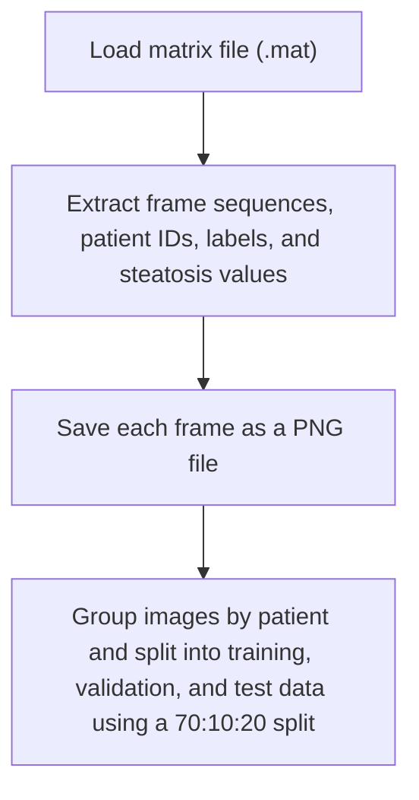

# Dataset of B-mode fatty liver ultrasound images

The Dataset of B-mode fatty liver ultrasound images contains 550 B-mode ultrasound images from 55 obese patients. Each image has a resolution of 434 x 636 pixels.

([Paper](https://link.springer.com/article/10.1007/s11548-018-1843-2), [Dataset](https://zenodo.org/records/1009146))

## Pre-processing

